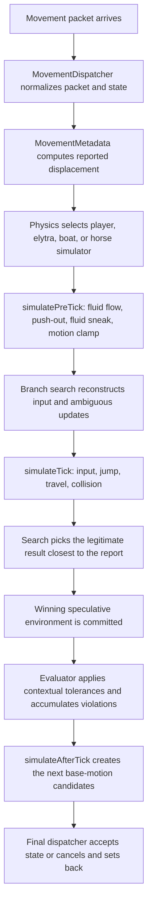

# Minecraft movement and Intave

## Purpose

This document explains how a Minecraft client movement tick maps to Intave's
movement code, and how to compare the two without confusing client state,
reported packet state, predicted state, and collision-resolved state.

The most important idea is:

> Intave is an inverse client, not a second client.

A real client starts with known input and computes one movement result. Intave
starts with a reported result, usually does not know all of the input or the
exact packet-relative timing of state changes, and searches for the legitimate
client execution that best explains that result.

This means that client code normally maps to a combination of:

- packet reconstruction in
  [`MovementDispatcher`](../src/main/java/de/jpx3/intave/module/dispatch/MovementDispatcher.java);
- persistent and speculative state in
  [`MovementMetadata`](../src/main/java/de/jpx3/intave/user/meta/MovementMetadata.java) and
  [`SimulationEnvironment`](../src/main/java/de/jpx3/intave/check/movement/physics/environment/SimulationEnvironment.java);
- unknown-input reconstruction in the
  [`physics.branch`](../src/main/java/de/jpx3/intave/check/movement/physics/branch) package;
- the actual client-physics port in the
  [`physics.simulator`](../src/main/java/de/jpx3/intave/check/movement/physics/simulator) package;
- versioned collision in
  [`player.collider`](../src/main/java/de/jpx3/intave/player/collider);
- comparison and tolerance logic in
  [`physics.evaluation`](../src/main/java/de/jpx3/intave/check/movement/physics/evaluation);
- orchestration, violation accumulation, and mitigation in
  [`Physics`](../src/main/java/de/jpx3/intave/check/movement/Physics.java).

Do not compare a complete client movement method to only `BaseSimulator`.
`BaseSimulator` intentionally stops and resumes around the point where the
client updates its position and later reports it to the server.

## The end-to-end model

The normal on-foot path is:



There are two packet subscribers around this process:

1. `MovementDispatcher.receiveMovement`, at low priority, reads and validates
   the packet, updates the working metadata, and calls
   `Physics.receiveMovement`.
2. `MovementDispatcher.receiveFinalMovement`, at high priority, fixes the
   on-ground claim, calls `Physics.endMovement`, advances accepted positions,
   and completes the client tick.

The split matters. Code that appears after `Entity.move` in the client usually
belongs in `simulateAfterTick`, not at the end of `simulateTick`.

## Client-code responsibility map

Minecraft mapping names change between releases and mapping sets. The names in
this table are common Mojang-mapped names, with older MCP-style names where
useful. Match responsibilities and order, not only method names.

| Minecraft client responsibility | Common client location | Intave location |
| --- | --- | --- |
| Sample movement keys and update sprint/sneak/use state | `LocalPlayer.aiStep`, older `EntityPlayerSP.onLivingUpdate`, input classes | `Input`, packet handlers in `MovementDispatcher`, and the movement branchers |
| Emit movement, input, action, and vehicle packets | `LocalPlayer.sendPosition`, `ServerboundMovePlayerPacket`, `ServerboundPlayerInputPacket`, `ServerboundPlayerCommandPacket`, `ServerboundMoveVehiclePacket` | `PlayerMoveReader` and `MovementDispatcher` |
| Apply server velocity or explosion motion before a client tick | client packet listeners updating `deltaMovement` | `MotionSetUpdate`, `MotionAddUpdate`, and `UpdateBrancher` |
| Clamp tiny velocity and apply pre-travel environmental updates | entity/player tick code before travel | `BaseSimulator.simulatePreTick` |
| Sneak and item-use input slowdown | local-player input update | first part of `BaseSimulator.simulateTick` |
| Jump and sprint-jump impulse | `LivingEntity.jumpFromGround` and fluid jump handlers | jump section of `BaseSimulator.simulateTick` |
| Ground/air acceleration and `moveRelative` | `LivingEntity.travel`, `handleRelativeFrictionAndCalculateMovement`, older `moveEntityWithHeading` and `moveFlying` | `MovementCharacteristics.resolveFriction` and `BaseSimulator.performRelativeMoveSimulationOfState` |
| Water and lava travel | `LivingEntity.travelInFluid` or version-equivalent travel branches | water/lava branches in `BaseSimulator` and the fluid package |
| Elytra travel | fall-flying branch of `LivingEntity.travel` | `ElytraSimulator` |
| Boat status, momentum, and control | `Boat.tick`, `Boat.controlBoat`, water-status helpers | `BoatSimulator` |
| Collision clipping and step-up | `Entity.move`, `collide`, `maybeBackOffFromEdge`, and `collectCandidateStepUpHeights` | `Colliders`, `v8Collider`, `v14Collider`, and `v21Collider` |
| Block callbacks and speed factors | `Block.fallOn`, `Block.updateEntityAfterFallOn`, `Block.stepOn`, `BlockState.entityInside`, `Entity.getBlockSpeedFactor` | `BaseSimulator.simulateAfterTick`, `BlockPhysics`, and `BlockProperties` |
| Gravity, levitation, drag, and slipperiness after movement | end of the relevant `travel` branch | `BaseSimulator.simulateNormalAfter`, `simulateWaterAfter`, and `simulateLavaAfter` |
| Pose, dimensions, and supporting block | entity pose/dimensions and `mainSupportingBlockPos` logic | `SimulationEnvironment.updatePose`, `Pose`, and `checkSupportingBlock` |
| Compare a report with expected movement | no client equivalent | `ThreeTickSimulationSearch`, `DefaultSimulationEvaluator`, and `Physics.evaluateBestSimulation` |

There is no client equivalent of the search or evaluator. Those exist because
the server observes packets instead of executing the player's input loop.

## State vocabulary

Most movement bugs in Intave are state-definition bugs rather than incorrect
constants. Before comparing formulas, identify which value the client formula
reads and which Intave value represents it.

### Positions

| Intave value | Meaning |
| --- | --- |
| `position` | The current position reported by the packet, or the speculative position in a branch. |
| `lastPosition` | The previous reported/working position. This is also manipulated while simulating omitted position reports. |
| `verifiedLastPosition` | The accepted origin from which the current movement is simulated and the reported offset is measured. |
| `verifiedLocation` | A Bukkit `Location` retained as the last clean location for additional collision and mitigation logic. It is not the primary simulation origin. |

`MovementMetadata.updateMovement` computes:

```text
sentOffsetMotion = position - verifiedLastPosition
```

It does not generally use `position - lastPosition`. This distinction becomes
visible when the client omits position from a packet, when Intave injects an
implicit flying tick, or while teleports are being acknowledged.

At the end of an accepted movement packet,
`MovementDispatcher.receiveFinalMovement` pushes `position` into
`verifiedLastPosition`.

### Motion values

| Intave value | Meaning |
| --- | --- |
| `baseMotion` | The client-like persistent velocity carried into the next pre-tick. This is the closest counterpart to a client's prior `deltaMovement`. |
| local simulator `motion` | A mutable working copy of the base motion for one branch. |
| `sentOffsetMotion` | The position displacement observed in the inbound movement packet. |
| `SimulationResult.offsetMotion` | The simulated positional displacement after edge backoff, collision clipping, and stepping. |
| `SimulationResult.actualMotion` | The motion retained for post-move processing. Its exact collision behavior is version-specific; do not assume it is always identical to either the requested movement or the positional offset. |
| `postTickSimulations` | All plausible persistent motions produced after the position update, ready for the next pre-tick. |
| `endMotion*Override` | A correction used when the selected positional explanation should not be allowed to poison the next persistent motion. |

The difference between `actualMotion` and `offsetMotion` is essential.
Collision can request a motion of `0.3` on X but move the bounding box by only
`0.1`. The positional report must be compared to `offsetMotion`; the next
client tick may need a version-dependent velocity derived from
`actualMotion`.

The legacy and modern colliders construct `actualMotion` differently. For
example, the legacy collider zeroes collided horizontal axes, while the modern
collider keeps the pre-clipping value and lets post-tick/configuration logic
decide whether to use it. Always trace the selected collider before deciding
which value corresponds to the client's `deltaMovement`.

### Ground and collision state

There are three separate ideas:

- the packet's claimed on-ground bit, read by `PlayerMoveReader`;
- `environment.onGround`, calculated from the selected collision result;
- `environment.lastOnGround`, the previous accepted collision state used by
  friction and jumping.

Intave treats collision as authoritative. The final dispatcher compares the
client claim with the simulated value and can rewrite the packet's on-ground
bit. The packet bit is not the general input to movement physics. Boats and a
few compatibility paths are explicit exceptions.

Likewise, `collidedHorizontally`, `collidedVertically`, `motionXReset`, and
`motionZReset` are results of a particular simulated move. Do not carry them
forward as timeless entity properties.

### Pose and dimensions

`Pose` controls the bounding box and eye height. The current set is:

- standing;
- crouching;
- swimming;
- fall flying;
- sleeping.

Pose sizes are versioned. Crouching uses the historical 1.8, 1.9, and 1.13+
heights, while swimming and fall flying use a `0.6 x 0.6` body. Modern pose
selection checks whether the target pose's box is collision-free and can fall
back to crouching or swimming when standing is obstructed.

Never compare collision traces made with different poses. A correct motion
formula with the wrong bounding box will produce a convincing but false
physics difference.

## One player tick in detail

### 1. Packet normalization

`PlayerMoveReader` hides the packet-class differences between:

- position-only;
- rotation-only;
- position-and-rotation;
- empty/flying;
- vehicle movement.

It also accounts for newer packet layouts, including the additional collision
information fields introduced in the 1.21.3-era packet structure and the
newer nested vehicle position structure.

`MovementDispatcher.receiveMovement` then:

- rejects non-finite values;
- separates `hasMovement` from `hasRotation`;
- handles vehicle rotation specially;
- recognizes teleport acknowledgements and packets that must be ignored;
- updates `MovementMetadata`;
- runs timer and interaction-related movement work;
- invokes the physics search.

A rotation-only or empty packet is not equivalent to "the player did not
move." It means only that this packet did not report a position. The client
may have advanced internally without crossing its position-report threshold.

### 2. Simulator selection

`Physics.selectSimulator` selects:

- `Simulators.BOAT` for a tracked ridden boat on client-controlled vehicle
  protocols;
- `Simulators.HORSE` for other client-controlled ridden entities;
- `Simulators.ELYTRA` while gliding outside water and lava;
- `Simulators.PLAYER` otherwise.

Selection is stateful. A direct comparison against the player travel method is
invalid if Intave selected boat or elytra movement for that packet.

### 3. Pre-tick

`BaseSimulator.simulatePreTick` performs calculations that happen before
movement input is applied:

1. update water flow, water/lava state, and eyes-in-water state;
2. push the player out of suffocating blocks;
3. apply the modern downward sneak-in-water impulse when the refreshed water
   state and client-version-specific flying rules allow it;
4. clamp tiny motion.

The pre-tick runs on both the main base motion and every
`postTickMotionCandidate`. Environmental mutations from the main pre-tick are
committed; candidate-specific environments are disposable.

Motion clamping is version-sensitive:

- older logic clamps each horizontal component independently using the
  per-version reset threshold;
- newer logic clamps X and Z together when horizontal length squared is below
  `0.000009`;
- Y is still clamped by the reset threshold.

The reset threshold is `0.005` for 1.8-and-older client protocols and `0.003`
for later protocols.

### 4. Reconstructing hidden input

For modern protocols that send the full input packet, `Input` supplies:

- forward/backward;
- left/right;
- jump;
- sneak;
- sprint.

Even then, not every client state can be enforced literally. For example, the
client can report that jump is held while being unable to perform a jump, and
the sprint input bit is not used as a strict sprint-state oracle.

For older protocols, the normal movement packet contains position, rotation,
and on-ground state but not WASD. Intave must infer the input. The tick search
branches in this order:

1. current or previous rotation for an implicit flying tick;
2. possible last post-tick motion;
3. keypress;
4. sprinting;
5. tick-ambiguous external updates;
6. item-use state;
7. attack-reduction count and timing;
8. jump.

The branch definitions are in
[`MovementSearchBranchers`](../src/main/java/de/jpx3/intave/check/movement/physics/branch/MovementSearchBranchers.java).

Key search tries a direction predicted from the reported acceleration, the
last selected keys, and finally the remaining key combinations. Impossible
combinations are pruned, such as movement while a movement-blocking inventory
is open or sprinting without forward input.

The search is deliberately optimistic: if at least one legitimate branch
explains the report, that branch should win.

### 5. Input scaling and attack reduction

`BaseSimulator.simulateTick` starts with discrete input:

```text
forward = configuration.forward * 0.98f
strafe  = configuration.strafe  * 0.98f
```

It then applies, in order:

- crouching/sneaking speed, including the sneaking-speed attribute and Swift
  Sneak;
- item-use slowdown (`0.2f`);
- possible pre-movement attack reductions, multiplying X and Z by `0.6` for
  each reconstructed reduction tick;
- a clamp after reconstructed reduction when necessary.

Do not move these multipliers into `moveRelative`. They alter the input vector
before normalization and therefore affect diagonal input differently from a
post-acceleration multiplier.

### 6. Jumping

The jump branch distinguishes:

- water jump (`+0.04F`);
- lava jump (`+0.04F`);
- ground jump;
- no jump.

Ground jump uses `environment.lastOnGround`, not the packet claim. Jump motion
comes from the jump-strength attribute or the historical `0.42f` default,
then applies the version-appropriate block jump factor and jump-boost effect.

For sufficiently new protocols, the code keeps the greater of the computed
jump and an already larger Y base motion. A sprint jump also adds:

```text
motionX -= sin(yaw) * 0.2F
motionZ += cos(yaw) * 0.2F
```

Swimming pitch adjustment occurs after the direct jump section and before
travel.

### 7. Relative movement and friction

On normal ground/air movement, Intave resolves acceleration as follows:

```text
if lastOnGround:
    drag = blockSlipperiness * 0.91f
    acceleration =
        aiMoveSpeed(sprinting) * frictionMultiplier / drag^3
else:
    acceleration = jumpMovementFactor
```

The historical `frictionMultiplier` is versioned:

- `0.16277136f` through the 1.15 protocol boundary;
- `0.16277137F` afterward.

The friction block lookup offset is also versioned:

- `1.0` through 1.15;
- `0.500001` afterward.

`performRelativeMoveSimulationOfState` is the port of `moveRelative` /
`moveFlying`:

```text
lengthSquared = strafe^2 + forward^2
if lengthSquared >= 0.0001f:
    length = sqrt(lengthSquared)
    scale = acceleration / max(1.0f, length)
    strafe *= scale
    forward *= scale
    motionX += strafe * cos(yaw) - forward * sin(yaw)
    motionZ += forward * cos(yaw) + strafe * sin(yaw)
```

This preserves the vanilla distinction between cardinal and diagonal input.

After relative movement, climbable blocks clamp X and Z to `0.15F`, cap
falling Y at `-0.15F`, and apply the sneak-on-ladder restriction where that
block supports it.

### 8. Water and lava

Water and lava use the same relative-movement transform with a fluid-specific
acceleration, but their post-tick drag and gravity differ.

Water handling includes:

- client-version-specific water-box sampling;
- flow-vector application before input;
- Depth Strider interpolation;
- Dolphin's Grace;
- swimming pose and pitch behavior;
- modern sprint-dependent horizontal drag;
- the wall-exit impulse;
- modern gravity special cases around `-0.003D`.

Lava handling uses `0.02f` relative acceleration, halves all motion after the
move, subtracts `0.02D` Y, and has its own wall-exit calculation.

Fluid behavior spans several components. When comparing client code, inspect
all of:

- `BaseSimulator`;
- `MovementCharacteristics`;
- the
  [`block.fluid`](../src/main/java/de/jpx3/intave/block/fluid) package;
- `FluidPhysics` and `BubbleColumnPhysics`.

Checking only the `inWater` branch in `simulateTick` misses pre-tick flow and
post-move block callbacks.

### 9. Collision

`Colliders.collision` applies any pending motion multiplier and selects a
collider based on the client protocol:

- legacy behavior through `v8Collider`;
- modern axis-order and step behavior through `v14Collider`;
- 1.21-era candidate-step-height behavior through `v21Collider`.

All versions conceptually perform:

1. cobweb motion scaling if applicable;
2. edge backoff while sneaking;
3. collection of block, border, and supported entity-induced collision
   shapes;
4. axis clipping;
5. optional step-up search;
6. construction of collision flags, positional offset, and retained motion.

The details are version-sensitive:

- the legacy collider uses fixed Y-X-Z clipping and two step candidates;
- the modern collider chooses X/Z order based on the dominant horizontal
  component;
- the 1.21 collider collects actual collision-shape Y coordinates as possible
  step heights.

Collision shapes come from the player's `BlockCache`, not directly from a
random Bukkit world query. `Collision` also applies:

- dynamic `CollisionModifiers`;
- the emulated world border;
- static entity-induced shapes;
- client-visible block-state and shape handling.

See [the block-system documentation](BLOCK_SYSTEM.md) before changing movement
collision. Correct movement math against the wrong shape is still incorrect.

### 10. Position update versus post-tick motion

The collider returns the movement that updates the client's position. Intave
then compares that positional offset with the packet.

Only after the position point does `simulateAfterTick` perform the rest of the
client movement work:

- rebuild the bounding box at the new position;
- clear web and collision-reset motion where required;
- choose the appropriate actual/collision motion;
- update the modern supporting block;
- update fall distance and aquatics;
- invoke block landed-on, stepped-on, and entity-inside hooks;
- apply soul-speed or block speed factors;
- apply water/lava or normal gravity and drag;
- apply modern block effects;
- estimate entity push.

For ordinary air/ground movement, normal post-tick processing applies
levitation or gravity and then:

```text
motionX *= slipperiness
motionY *= 0.98f
motionZ *= slipperiness
```

This output is the next `baseMotion`, not the displacement to compare with the
current packet.

### 11. Search, omitted reports, and commit

[`ThreeTickSimulationSearch`](../src/main/java/de/jpx3/intave/check/movement/physics/search/ThreeTickSimulationSearch.java)
simulates every surviving movement configuration in an isolated
`MutableSimulationEnvironmentView`.

The view is copy-on-write. Branch mutations are deferred, and only the winning
branch is committed to live `MovementMetadata`. A simulator must not mutate
global movement state directly while exploring a branch.

The search first tries to explain the report with the current tick. It can then
simulate up to two additional implicit flying ticks to account for client
ticks whose position was not sent. Search depth and branch counts are bounded
and rate-limited.

The first-tick target is strict. Later implicit-tick targets can use small
fuzzy thresholds when the protocol and movement state make packet omission
inaccurate, particularly around tiny movement, sneaking, and water.

For a packet without position, `Physics.receiveMovement` asks
`tryMoveReinterpretation` whether the selected simulation would legitimately
have produced a non-position-reporting packet. If so, Intave advances the
internal position by the predicted offset. If not, it restores the previous
base motion and only refreshes its on-ground estimate.

After the position result is chosen, `afterTickMotionCandidates` traces which
movement-configuration fields the post-tick code actually reads. If post-tick
motion depends on an unresolved field, such as jump or sprint, it generates
all unique plausible next motions. `PreviousPostTickBrancher` resolves those
candidates on the following movement.

### 12. Evaluation and mitigation

Search answers:

> Which legitimate simulation is closest?

Evaluation answers:

> Is the remaining difference meaningful in this context?

`DefaultSimulationEvaluator` evaluates horizontal and vertical differences
separately. Its tolerances account for conditions that cannot always be
reconstructed exactly from server observation, including:

- omitted/flying packets;
- water flow and fluid transitions;
- collision and pose transitions;
- pistons and shulkers;
- velocity packet timing;
- firework and riptide motion;
- webs, ladders, slime, and boats;
- entity push;
- protocol-specific masked motion.

It produces contextual `EvaluationTag` values as well as a violation
increment. `Physics.evaluateBestSimulation` adds buffering, collision sanity
checks, trust-factor handling, violation decay, and setback policy.

Therefore, equality with a decompiled client output is a useful unit test but
is not the production decision rule. Do not "fix" an apparent mismatch by
removing evaluator tolerance unless the upstream packet ambiguity has also
been removed.

## Input signs and a current naming trap

The numeric convention used by `Input`, `KeypressBrancher`, the simulator, the
physics key display, and `BoatSimulator` is:

| Value | Meaning |
| --- | --- |
| `forward = 1` | W / forward |
| `forward = -1` | S / backward |
| `strafe = 1` | A / left |
| `strafe = -1` | D / right |

At yaw zero, positive strafe contributes positive X in
`performRelativeMoveSimulationOfState`, matching left movement while facing
positive Z.

There is currently an opposite-label trap in
`MovementConfiguration.keysToString()` and the
`pressingA()`/`pressingD()` convenience methods: those helpers label or build
the strafe signs in the other direction. When comparing or debugging physics,
use the numeric convention above and inspect `forward()`/`strafe()` directly.
Do not infer the direction from those helper names or from
`MovementConfiguration.toString()`.

## Version selection

Always start a comparison by identifying both:

1. the client protocol version;
2. the server runtime version and any ViaVersion/ViaBackwards translation.

[`ProtocolMetadata`](../src/main/java/de/jpx3/intave/user/meta/ProtocolMetadata.java)
centralizes client feature boundaries. Important movement gates include:

| Feature gate | Movement consequence |
| --- | --- |
| `combatUpdate` | 1.9+ sprint/item/vehicle behavior and entity push path |
| `aquaticUpdate` / `swimmingMechanics` | 1.13+ fluids and swimming pose |
| `applyModernCollider` | 1.14+ collider |
| `delayedSneak` / `alternativeSneak` | versioned pose timing |
| `beeUpdate` | 1.15+ sneak/jump behavior boundaries |
| `cavesAndCliffsUpdate` | 1.17+ evaluator and packet behavior |
| `trailsAndTailsUpdate` | supporting-block-based friction/block lookup |
| `sendsInputs` | full input enforcement when both client and server support the packet |
| `newMotionClampLogic` | newer horizontal clamp behavior |
| `newBlockEntityIntersectionLogic` | newer block-intersection path |

Do not replace feature methods with a check against the server version.
Movement physics is primarily selected from the client protocol. Conversely,
some packet features require server support too, and
`MinecraftVersions` checks intentionally appear beside protocol checks.

This distinction is particularly important for old clients connected through
ViaVersion. The old client may have old motion formulas while the modern
server drops or rewrites packet forms that the old native server would have
seen. `emptyFlyingPacketsAreExplicitlySent` is an example of a decision that
depends on both sides.

When porting a change:

- add or use a semantic feature method in `ProtocolMetadata`;
- select a collider, shape, or formula from the client protocol;
- separately gate packet parsing on what the current server can expose;
- test native and translated client/server pairs.

## Precision and arithmetic pitfalls

Minecraft movement is sensitive to Java's exact numeric behavior. Preserve:

- `float` constants such as `0.98f`, `0.91f`, and `0.02f`;
- the location of float-to-double promotion;
- expression order;
- exact comparisons used by collision;
- the client's trigonometric lookup behavior;
- flooring behavior at negative coordinates.

Intave uses [`ClientMath`](../src/main/java/de/jpx3/intave/share/ClientMath.java)
and [`SinusCache`](../src/main/java/de/jpx3/intave/math/SinusCache.java) to
mirror client math. Replacing a lookup-table `sin` with `Math.sin`, changing
`0.98f` to `0.98`, or algebraically rearranging friction can create repeatable
movement drift.

Some specific hazards:

- `float * float` rounds before the result is widened to `double`;
- a diagonal input is normalized after the `0.98f` key scaling;
- a block coordinate must use floor, not a Java cast, for negative positions;
- `Motion` is mutable, so branches must use `copy()` before modifying it;
- `Motion.equals` has its own small tolerance and is used to merge candidate
  motions;
- collision axis order changes the result at corners.

When chasing a difference smaller than a few thousandths, print the
intermediate float bit patterns or hexadecimal floating-point values, not
only rounded decimal output.

## Packet timing and causal ambiguity

The server can know that a velocity, explosion, action, or state update was
sent, but not always on which exact client movement tick it became effective.

Intave models this with:

- `TickAmbiguousUpdate`;
- `CausalConstraint`;
- `MotionSetUpdate` for entity velocity;
- `MotionAddUpdate` for explosion knockback;
- `UpdateBrancher`.

Outbound packets are connected to client progress through tick feedback. An
update is given a not-before/not-after interval and a sequence number. The
search branches over the causally valid points at which it could have affected
the client's base motion, while preserving packet order.

Do not directly assign a received server velocity to live `baseMotion` just
because the server sent the packet before the movement packet arrived. That
assumes network receipt timing that the server does not observe.

The same principle applies to:

- effect and attribute updates;
- sprint and sneak action packets;
- item-use activation/release;
- teleports and relative teleport components;
- block updates whose client acknowledgement is delayed.

## World-view pitfalls

A decompiled client simulates its local world, not the server's instantaneous
Bukkit world. Intave's closest equivalent is the per-user `BlockCache`.

Before blaming the motion formula, compare:

- material and variant;
- collision shape, not outline or visual shape;
- shape position/contextualization;
- pose-sized player bounding box;
- block update acknowledgement state;
- world border;
- moving shulker and piston modifiers;
- powder snow, scaffolding, doors, carpets, and other collision modifiers;
- entity-induced collision shapes;
- scale attribute and resulting collision scan limits.

Friction and collision can also intentionally read different blocks.
`collideMaterial` represents landing/step callbacks, while
`frictionMaterial` represents slipperiness and speed/jump factors. Newer
clients may select the main supporting block rather than simply flooring the
player position.

If a client trace and Intave disagree only near an edge, first dump:

```text
pose
bounding box
requested motion
collision shape boxes
axis order
offset motion
actual motion
main supporting block
collide material
friction material
```

## Special movement modes

### Elytra

`ElytraSimulator` ports the pitch/look-vector fall-flying formula and is
independent of WASD branching. It:

- applies pitch-dependent gravity;
- converts some downward motion into forward motion;
- converts upward look and horizontal speed into lift;
- steers horizontal motion toward the look vector;
- applies `0.99f` horizontal and `0.98f` vertical drag;
- runs normal collision afterward.

The selected look vector comes from the version-compatible rotation math in
the environment. Comparing elytra output with a trace that uses a different
trigonometric implementation will produce visible drift.

### Boats

`BoatSimulator` has a `0.0f` step height and models:

- in-water, underwater, flowing-water, land, and air status;
- water level;
- land glide from supporting-block slipperiness;
- status-dependent gravity and momentum;
- forward/back/side control;
- collision and boat-specific setback behavior.

The vehicle movement packet's rotation is deliberately ignored by the
dispatcher because that field describes the boat rotation rather than the
player look used elsewhere; Intave relies on the preceding look packet.

### Other ridden entities

`HorseSimulator` currently inherits the base player simulator and contains no
complete horse movement port. `Physics.evaluateBestSimulation` suppresses the
movement violation increment when the selected simulator is `HORSE`.

Treat this as a non-enforced approximation, not horse-client parity. A horse
physics change should start with a dedicated simulator and recordings rather
than tightening the evaluator around the inherited player model.

## Known approximation boundaries

Several production concerns make exact client parity impossible or
intentionally incomplete:

- hidden pre-1.21.3 input must be searched;
- input, action, velocity, and world-update packets have network ambiguity;
- entity push depends on the set and accuracy of tracked entities;
- client-side block knowledge may lag the server;
- translated protocol stacks can suppress native packet behavior;
- search depth and candidate counts are bounded for performance;
- the evaluator intentionally tolerates known ambiguous transitions;
- `HorseSimulator` is not a full horse implementation;
- `BoatSimulator` documents a missing `hasNoGravity` branch;
- the newer swept block-effect helper in `BaseSimulator.checkInsideBlocks`
  is currently a stub, while the existing current-box block callback loop
  remains active.

When client code contains a behavior that is absent in Intave, decide which
category it belongs to:

1. deterministic and observable: port it into the correct simulation phase;
2. deterministic but based on hidden input: add a configuration field or
   branch;
3. packet-timing ambiguous: add a constrained update;
4. dependent on imperfect world/entity observation: improve tracking and keep
   a bounded evaluator tolerance;
5. irrelevant to the position or next persistent motion: do not add it to the
   movement simulator.

## A reliable client-to-Intave comparison workflow

### 1. Pin the exact environment

Record:

- client version and protocol number;
- server version;
- translation stack;
- game mode and abilities;
- movement-speed, scale, jump-strength, gravity, and sneaking-speed
  attributes;
- active effects and enchantments;
- pose, sprint, sneak, item-use, and vehicle state.

Do not use "modern" or "legacy" as the version specification.

### 2. Choose the client phase

Locate the client line relative to:

```text
input update
pre-travel environmental update
jump
relative acceleration
fluid/air travel
Entity.move / collision
block callbacks
gravity and drag
movement packet emission
```

Then place the Intave counterpart in `simulatePreTick`, `simulateTick`,
the collider, or `simulateAfterTick`.

### 3. Seed the same state

At minimum, align:

- `verifiedLastPosition`;
- bounding box and pose;
- `baseMotion`;
- `lastOnGround`;
- yaw and pitch;
- fluid state;
- supporting/friction/collision block;
- movement configuration;
- pending external updates.

Using the reported packet offset as the client's starting velocity is a common
mistake. Start from `baseMotion`.

### 4. Compare intermediate values

Compare in this order:

1. pre-tick motion;
2. scaled forward/strafe;
3. jump result;
4. friction/acceleration;
5. motion before collision;
6. collision-resolved `offsetMotion`;
7. collision flags and `actualMotion`;
8. post-tick next base motion;
9. final reported packet delta.

The first differing stage is usually the cause. Comparing only final
coordinates hides compensating errors.

### 5. Separate search from physics

For formula parity, call a concrete simulator with an explicit
`MovementConfiguration`. Do not begin with the full search, because a wrong
branch can look like a wrong formula.

After the explicit simulation matches, test the branch search to ensure it can
discover that configuration from the available packet evidence.

### 6. Test packet omission separately

Run at least:

- a position-and-rotation packet every tick;
- rotation-only or empty packets between position reports;
- a velocity whose acknowledgement straddles a movement tick;
- a block or pose transition during a skipped report.

Single-tick parity does not prove that `baseMotion` survives packet omission
correctly.

### 7. Verify acceptance and mitigation

Finally verify:

- selected branch;
- search distance;
- evaluator tags and tolerances;
- horizontal and vertical violation increments;
- next post-tick motion candidates;
- whether the final dispatcher accepts, rewrites, or cancels the packet.

A simulator can be correct while evaluation is too strict, and evaluation can
hide a simulator error. Test them as separate layers.

## Tests and recordings

The fastest deterministic example is
[`ExamplePhysicsTest`](../src/test/java/de/jpx3/intave/check/movement/physics/ExamplePhysicsTest.java),
which uses a test world and explicit movement configurations.

Useful test areas are:

- `src/test/java/de/jpx3/intave/check/movement/physics` for simulator and
  environment behavior;
- `src/test/java/de/jpx3/intave/player/collider` and block-shape tests for
  collision;
- `MovementRecordingPhysicsTests` for real packet/frame replay;
- `PhysicsTestRecorder` and the movement recording classes for capturing
  regressions.

Example Windows commands:

```powershell
.\gradlew.bat test --tests de.jpx3.intave.check.movement.physics.misc.ExamplePhysicsTest
.\gradlew.bat test --tests de.jpx3.intave.check.movement.physics.recording.MovementRecordingPhysicsTests
```

A good movement regression recording includes a few stable ticks before the
interesting action and enough ticks afterward to validate post-tick motion.
Capture attributes, inputs where available, external velocity actions, block
states, fluids, and both client/server versions.

When adding a unit test for a ported formula, assert both:

- the current tick's `SimulationResult.offsetMotion`;
- the next `baseMotion` after `simulateAfterTick` or `simulateBetween`.

Asserting only the first value misses gravity, drag, collision reset, block
callbacks, and candidate propagation.

## Review checklist

Before merging a movement change, verify:

- [ ] The exact client version and mapping set were identified.
- [ ] The change is in the correct pre-tick, tick, collision, or post-tick phase.
- [ ] Client protocol and server packet support are gated separately.
- [ ] Float constants, casts, operation order, and client trig are preserved.
- [ ] Forward/strafe signs were checked numerically.
- [ ] The correct pose and bounding box are used.
- [ ] `baseMotion`, `offsetMotion`, `actualMotion`, and `sentOffsetMotion` were not conflated.
- [ ] `onGround`, `lastOnGround`, and the packet claim were not conflated.
- [ ] All speculative mutations stay inside the branch environment.
- [ ] A hidden state was modeled as a branch or constrained update instead of guessed globally.
- [ ] Collision uses the per-user block cache and versioned shape.
- [ ] Position-report omission and multi-tick behavior were tested.
- [ ] Both positional output and next persistent motion were asserted.
- [ ] Evaluator tolerance was reviewed separately from simulator parity.
- [ ] Native and protocol-translated client/server combinations were considered.

If all of these are explicit, comparing Minecraft client movement to Intave
becomes a phase-by-phase engineering task instead of a final-coordinate
guessing exercise.
